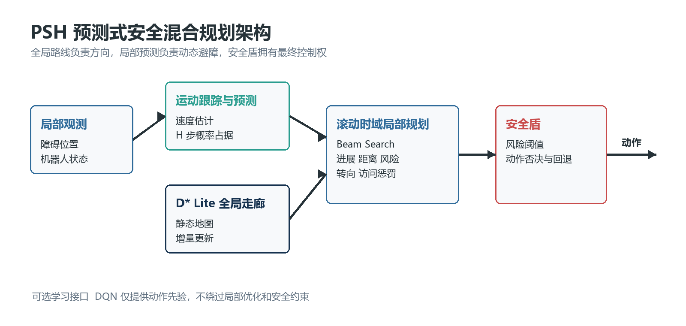
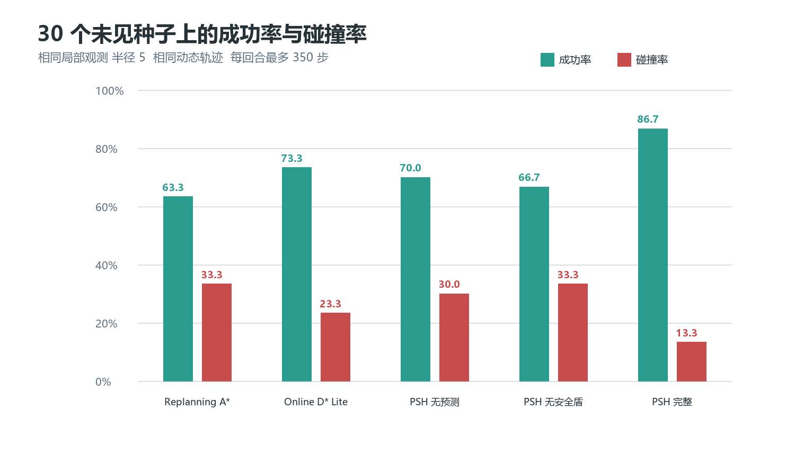

# PSH Planner

面向局部观测与动态障碍的预测式安全混合路径规划器。

PSH 不再把项目停留在 A*、Q-learning、DQN 的横向演示上，而是围绕一个明确问题展开：**在固定局部观测和在线计算预算下，短时运动预测与独立安全约束能否降低动态导航碰撞率？**



## 研究贡献

- 用连续局部观测估计障碍速度，生成未来 7 步的概率占据图。
- 用 D* Lite 维护全局走廊，用滚动时域 Beam Search 优化局部动作序列。
- 在控制出口加入独立安全盾，拒绝高风险动作并选择可行回退动作。
- 为已有 DQN 保留可选动作先验接口，但学习策略不能绕过安全约束。
- 统一在线 A*、在线 D* Lite 和 PSH 的观测条件、动态轨迹与计算指标，并提供组件消融。

## 核心结果

30 个未见随机种子，24 x 32 地图，4 个移动障碍，局部观测半径 5，每回合最多 350 步。

| 方法 | 成功率 | 碰撞率 | 最小间距 | 平均规划延迟 |
| --- | ---: | ---: | ---: | ---: |
| 在线重规划 A* | 63.3% | 33.3% | 1.93 格 | 0.29 ms |
| 在线 D* Lite | 73.3% | 23.3% | 2.09 格 | 0.16 ms |
| PSH 无预测 | 70.0% | 30.0% | 1.92 格 | 4.62 ms |
| PSH 无安全盾 | 66.7% | 33.3% | 1.97 格 | 4.65 ms |
| **PSH 完整系统** | **86.7%** | **13.3%** | **2.10 格** | **4.50 ms** |



完整系统相对在线 D* Lite 将碰撞率从 23.3% 降至 13.3%，成功率提高 13.4 个百分点。消融中去掉预测或安全盾都会使结果明显下降，说明提升来自模块协同，而不是单纯增加搜索计算量。完整逐回合数据位于 `results/psh_benchmark/episodes.csv`。

## 架构

```text
局部观测 -> 障碍跟踪与运动预测 -> 时空风险图
                                      |
静态地图 -> D* Lite 全局走廊 -> 滚动时域搜索 -> 安全盾 -> 动作
                                      ^
                              可选 DQN 动作先验
```

局部优化目标同时考虑目标距离、全局走廊偏离、动作代价、重复访问和预测碰撞风险。规划器每次只执行序列中的第一个动作，获得新观测后立即重算。

## 快速开始

```powershell
python -m pip install -r requirements.txt
python -m unittest discover -s tests -v
python benchmark_psh.py --quick --seeds 20 21 22
```

完整实验：

```powershell
python benchmark_psh.py --seeds 20 21 22 23 24 25 26 27 28 29 30 31 32 33 34 35 36 37 38 39 40 41 42 43 44 45 46 47 48 49
```

输出包括逐回合 `episodes.csv` 和聚合 `summary.json`。固定种子同时控制地图、移动障碍初始位置和随机游走，因此不同规划器使用同一条动态轨迹。

## 项目结构

```text
psh_planner/
  prediction.py       # 障碍跟踪与概率占据预测
  local_planner.py    # 滚动时域 Beam Search
  safety.py           # 动作级安全盾
  hybrid.py           # PSH 总控与 D* Lite 全局走廊
  baselines.py        # 同观测条件的在线基线
benchmark_psh.py      # 多种子实验与消融
tests/                # 环境和规划组件回归测试
docs/                 # 方法说明、图和技术报告
results/psh_benchmark # 可复现实验原始结果
```

## 方法边界

当前结果来自离散栅格仿真，不代表真实机器人部署。模型尚未覆盖机器人半径、连续速度和加速度约束、通信延迟以及多机器人互相避让。面向实体平台的下一步是把概率风险图接入连续轨迹优化器，并使用带时间戳的状态估计替代匿名最近邻跟踪。

## 参考

- Koenig, S. and Likhachev, M. D* Lite. AAAI, 2002.
- Fox, D., Burgard, W. and Thrun, S. The Dynamic Window Approach to Collision Avoidance. IEEE Robotics and Automation Magazine, 1997.
- van den Berg, J. et al. Reciprocal n-body Collision Avoidance. Robotics Research, 2011.

详细问题定义、目标函数、实验协议和局限性见 [技术报告](docs/PSH_Planner_技术报告.docx)。
